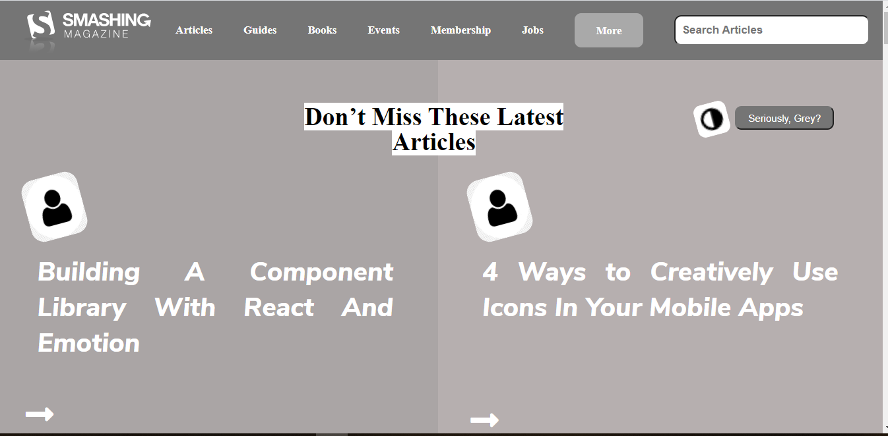

# Smashing-Magazine-webpage

This project consists of building a heatmap of the Smashing magazine website
​

​
## Project Requirements

- Align all elements with float and flex or grid.
- Use Article tag for all articles listed on the page
- Make sure to build your layout using a width of 1440px on the original page. 

## Built With

- HTML
- CSS
​
## Live Demo
[Live Demo Link](https://delicelydia.github.io/Smashing-Magazine-webpage/index.html)
​
## Author
- Github: [@DeliceLydia](https://github.com/DeliceLydia)
- Twitter: [@IngabireLydia3](https://twitter.com/IngabireLydia)
- Linkedin: [Delice Lydia](https://www.linkedin.com/in/delice-lydia-91b55b167/)

## Show your support
​
Give a ⭐️ if you like this project!
